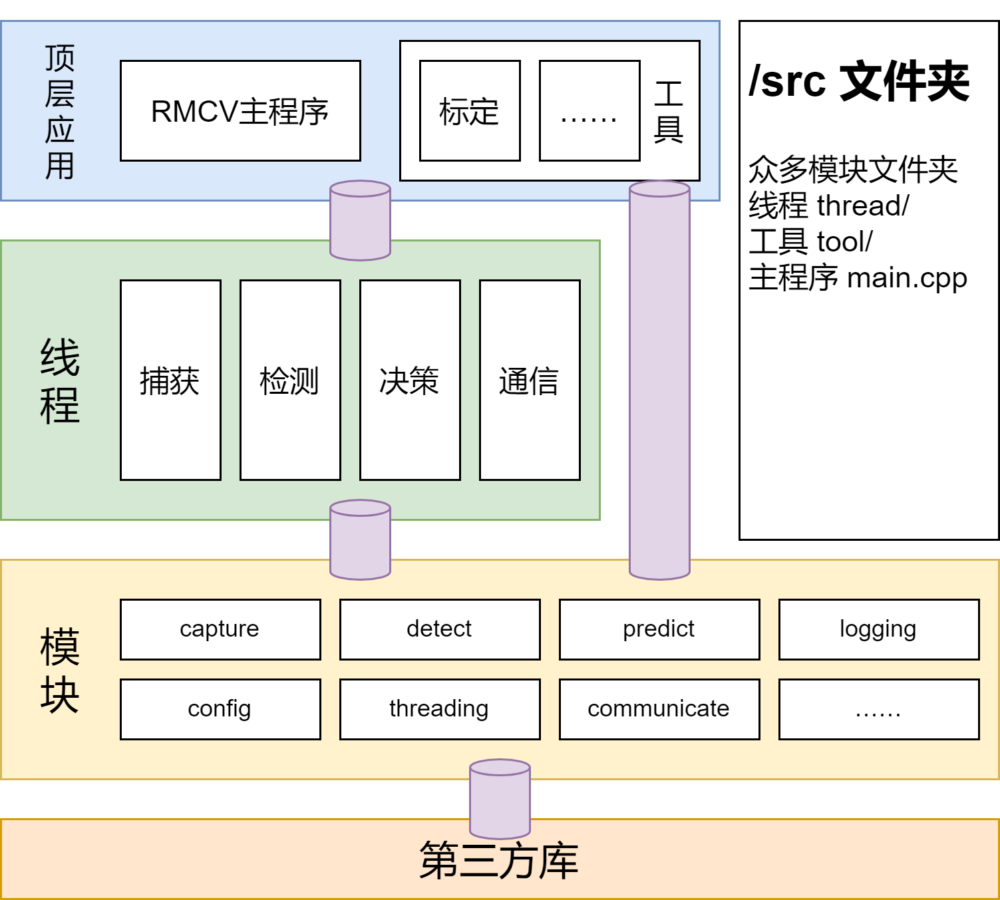

# 铁人战队 RoboMaster2022 视觉

## 开发环境

- GCC/G++ 11
- OpenCV 4.5.3
- [toml11](https://github.com/ToruNiina/toml11) 3.7.1
- [serial](https://github.com/wjwwood/serial) git
- fmt 8.1.1

### 二选一

- TensorRT 8
- OpenVino 2021.4

## 代码结构

## 运行

TODO

## 编译

TODO